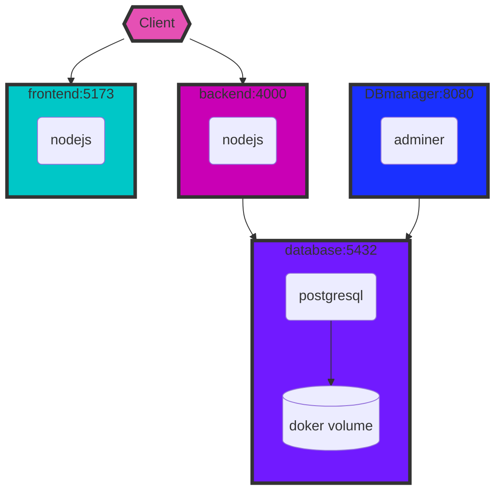
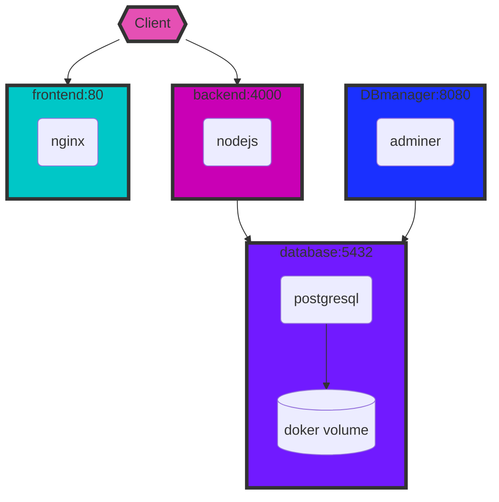

<p align="center">
  <h1 align="center">Camagru</h1>
  <h4 align="center">instagram-like web application</h4>
  <p align="center"></p>
</p>
<br />
<br />


<p align="center">
  
</p>


<p align="center">
  A static demo version is available here: <a blank="_" href="https://jibus22.github.io/camagru">Camagru</a>
</p>

## Project presentation

### stack

- vanilla nodejs
- vanilla javascript
- postgresql
- vitejs
- sass

<details>
<summary>Guidelines</summary>

> This web project is challenging you to create a small web application allowing you to make basic photo and video editing using your webcam and some predefined images.

### user

- [x] The application should allow a user to sign up by asking at least a valid email address, an username and a password with at least a minimum level of complexity.
- [x] At the end of the registration process, an user should confirm his account via a unique link sent at the email address fullfiled in the registration form.
- [x] The user should then be able to connect to your application, using his username and his password. He also should be able to tell the application to send a password reinitialisation mail, if he forget his password.
- [x] The user should be able to disconnect in one click at any time on any page.
- [x] Once connected, an user should modify his username, mail address or password.

### gallery

- [x] This part is to be public and must display all the images edited by all the users, ordered by date of creation. It should also allow (only) a connected user to like them and/or comment them.
- [x] When an image receives a new comment, the author of the image should be notified by email. This preference must be set as true by default but can be deactivated in user’s preferences.
- [x] The list of images must be paginated, with at least 5 elements per page.

### editing

This part should be accessible only to users that are authentified/connected and gently reject all other users that attempt to access it without being successfully logged in.
This page should contain 2 sections:
- [x] A main section containing the preview of the user’s webcam, the list of superposable images and a button allowing to capture a picture.
- [x] A side section displaying thumbnails of all previous pictures taken. Your page layout should normally look like in Figure V.1.
- [x] Superposable images must be selectable and the button allowing to take the picture should be inactive (not clickable) as long as no superposable image has been selected.
- [x] The creation of the final image (so among others the superposing of the two images) must be done on the server side.
- [x] Because not everyone has a webcam, you should allow the upload of a user image instead of capturing one with the webcam.
- [x] The user should be able to delete his edited images, but only his, not other users’ creations.

### Constraints

- Every framework, micro-framework or library that you don’t create and without an equivalent in PHP standard library are totally forbidden, except for CSS frameworks that doesn’t need forbidden JavaScript.
- Authorized languages:
    - [Server] Any (limited to PHP standard library)
    - [Client] HTML - CSS - JavaScript (only with browser natives API)
- Authorized frameworks:
  - [Server] Any (up to PHP standard library)
  - [Client] CSS Frameworks tolerated, unless it adds forbidden JavaScript.
  
</details>

## App presentation

<details>
<summary>Videos</summary>

_Sign up & sign in_

https://github.com/Jibus22/camagru/assets/59167486/56d914b9-b720-4ca7-96d9-46e04ac8efc4

_Profile editing_

https://github.com/Jibus22/camagru/assets/59167486/60e0c434-9e14-4030-bca8-8b4ab7fbfb64

_Mail update feature_

https://github.com/Jibus22/camagru/assets/59167486/c167432d-e30c-44bf-85e2-d3b3691d4e52

_Password reset feature_

https://github.com/Jibus22/camagru/assets/59167486/23e1755f-f49f-45aa-b2e9-da270cce6108

_Photo editing panel_

https://github.com/Jibus22/camagru/assets/59167486/560fff42-742a-4955-b096-520a7f1292c8

</details>


<details>
<summary>Diagrams</summary>

_Docker containers infrastructure for dev_



_Docker containers infrastructure for prod_



_Database diagram_


</details>


## Deployment

### Data

A **fake database dump** is provided and will be automatically imported by the postgresql container on the first start. The database **fake credentials** are stored in environment for db name and username, and in `not_so_secret` directory for the password. You can provide other credentials if needed, by changing these, before running containers.

If ever no dump is used, the database will be empty and the backend will be in charge to create necessary tables at the startup.

### Environment

As this app sends mails to the user but doesn't use any service for that, you must provide your own mail credentials, either in two files - without trailing '\n' :
- `secret/mailPass.txt` (ex: `dJhr4khS!Jsl?`)
- `secret/mailUser.txt` (ex: `yourmailaddresse@mail.any`)

either in environment variables that you can add into .env file:
- `USERMAIL` (ex: `dJhr4khS!Jsl?`)
- `PWDMAIL` (ex: `yourmailaddresse@mail.any`)

Your host mail must be set in `HOSTMAIL` variable (ex: smtp.laposte.net). Note that it must support SMTPS protocol (port 465), otherwise you still can change `back/src/mail/sendMail.js` file to change to SMTP port 587 and remove secure option:

https://github.com/Jibus22/camagru/blob/728316781fdd1276ebab79f822c11d61acc39f58/back/src/mail/sendMail.js#L23-L31

<details>
<summary>Development</summary>

### Containers

It uses 3 docker images:

- node:18-buster-slim - 237MB
- postgresql:15.3-alpine - 236MB
- adminer - linuxkit - 250MB


To deploy it locally for development just run:

```sh
docker compose -f docker-compose.dev.yml up
```

adminer is a php service to manage database, accessible through `localhost:8080`.

node image is used to build 2 development containers: front and back.

Front-end hmr development server is backed by **vitejs** and back-end with **nodemon**,
so the edited files on the host which are mapped into the containers, triggers a
server reload when changed.

Finally the postgresql image is a database service used to serve data from
a docker volume.

</details>

<details>
<summary>Production</summary>

### Containers

It uses 3 docker images:

- camagru-front-end - 53MB
- node:18-buster-slim - 237MB
- postgresql:15.3-alpine - 236MB


To deploy it locally for development just run:

```sh
docker compose -f docker-compose.yml up
```
camagru-front-end is a homemade **multi-stage** image. It starts from a node image to build the app, then copies the dist folder to a **nginx** image which serves the files on `http://localhost:80`. It permits to get a lightweight server because nginx doesn't need all nodejs environment to serve files.

</details>
